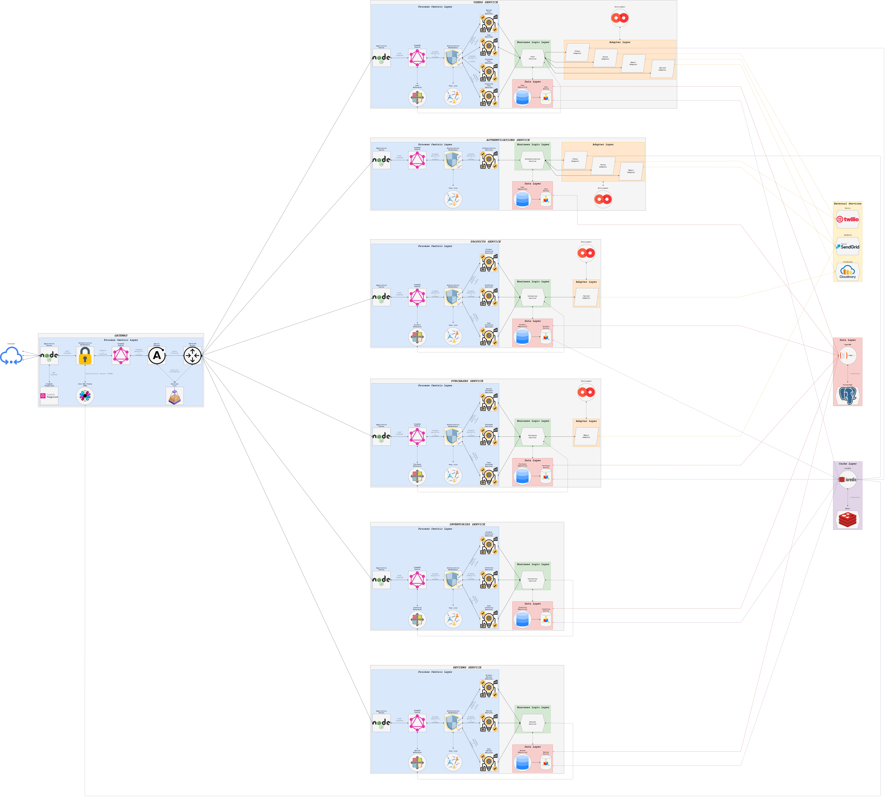

# Graph Market

Graph Market is an online E-commerce platform.

Sellers can publish their products, providing images and descriptions; users can browse such products and, upon registration, buy and review them.

When a user registers themselves, Graph Market sends both an email and SMS key which are required to complete the registration process.

[](https://github.com/carlocorradini/graphmarket/actions)
[](https://www.codacy.com/gh/carlocorradini/graphmarket/dashboard?utm_source=github.com&utm_medium=referral&utm_content=carlocorradini/graphmarket&utm_campaign=Badge_Grade)
[](https://codecov.io/gh/carlocorradini/graphmarket)
[](https://snyk.io/test/github/carlocorradini/graphmarket)
[](https://app.fossa.com/projects/git%2Bgithub.com%2Fcarlocorradini%2Fgraphmarket?ref=badge_shield)

**Members**:

|  Name  |  Surname  |     Username     |    MAT     |
| :----: | :-------: | :--------------: | :--------: |
| Carlo  | Corradini | `carlocorradini` | **223811** |
| Andrea |  Stedile  | `andreastedile`  | **220930** |

## Architecture

Graph Market has a Service-Oriented Architecture implemented by six microservices (Please also see section Distributed Scenario):

- _Authentications_: Provides authentication and authorization facilities.
  - Uses the Twilio API to deliver an SMS message containing a key involved in the registration process.
  - Uses the SendGrid API to deliver an email containing a key involved in the registration process.
- _Users_
- _Products_: Uses Cloudinary to store product images uploaded by sellers.
- _Inventories_
- _Purchases_
- _Reviews_

A gateway acts as an entry point for GraphQL client requests, which are orchestrated and fulfilled by GraphQL Federation.

[](./images/architecture.png)

Note that the image above is a bit deceptive: in principle, all services might have their own Cache Layer (i.e., their own Redis instance).

Full quality image: [images/architecture.png](./images/architecture.png)

## Source code organization

Graph Market's uses [Lerna](https://lerna.js.org/) for managing its various packages. A package either implements an individual microservice or other common functionalities.

## Build and run (single host)

In the following, we explain how to build and run Graph Market's services on a single host. We assume a database and a Redis instance are already running on the machine.

Clone the repo:

```bash
git clone https://github.com/carlocorradini/graphmarket
cd graphmarket
```

Install the dependencies and build the packages:

```bash
npm ci
npm run bootstrap
```

To properly configure a service, you must define its environment. Rename each package's _.env.example_ to _.env_ and edit it, according to your needs. You can, for example:

- Adjust the database URL,
- Change the port on which a service is started,
- Specify keys for the service adapters (e.g., Twilio).

Start the services:

- In development mode:
  ```bash
  npm run start:dev:services
  ```
- Or in production mode:
  ```bash
  npm run start:services
  ```

Start the gateway:

- In development mode:

  ```bash
  npm run start:dev:services
  ```

- Or in production mode:

  ```bash
  npm run start:services
  ```

The services should start and complete the startup phase before the gateway. When the gateway starts, it runs a health check procedure that checks for each service's availability. After 3 failed attempts, the procedure raises an error, thus preventing the gateway to start.

In development mode, you might want to load the database with some data. To do so:

```bash
cd scripts
./delete.sh
./load.sh
```

## Build and run (distributed scenario)

In principle, simulating and testing a distributed set of services could be done using Docker and Docker Compose (with a limitation: all services would belong to the same subnet). Docker would also be beneficial as it would remove the barrier "it works on my computer", thus providing repeatability guarantees.

However, Docker support was not provided step-by-step from the beginning, thus making a bug-free provision impossible. Docker support could be added in the future.

Docker-related files are kept in a dedicated branch called `docker`.

## Build and run the website

The website's code is hosted uder the _website_ directory. Build and launch it:

```bash
cd website
npm ci
ng serve --open
```

To configure the website, edit its environment, inside the _src/environmets_ directory.

## Tests

From the project's root directory:

```bash
npm test
```

And:

```bash
npm run coverage
```

## License

MIT

[](https://app.fossa.com/projects/git%2Bgithub.com%2Fcarlocorradini%2Fgraphmarket?ref=badge_large)
